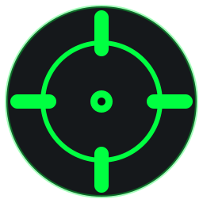

<div align="center">



# Linux Overlay Sight

**Crosshair overlay for Linux · KDE Plasma · XWayland**

Draws a crosshair on top of any game — including fullscreen mode via Wine/Proton

[](https://python.org)
[](https://pypi.org/project/PyQt6)
[](https://kernel.org)
[](https://kde.org)
[](LICENSE)

[🇺🇸 **English**] · [🇷🇺 **Русский**](README.md)

</div>

---

## Why

Some games don't show a crosshair in certain situations — shooters, third-person MMOs. A physical sticker on the monitor is ugly. LOS is a software alternative: an invisible OS-level window with a crosshair exactly at the screen center.

Works above **fullscreen** games via Wine / Proton on **XWayland** — where most other solutions break.

---

## Features

| | |
|---|---|
| 🎯 **4 crosshair styles** | dot · cross · dot+cross · circle |
| 🎨 **Color** | any HEX, separate outline color |
| 🔆 **Opacity** | slider 50–255 |
| 📐 **Size / thickness / gap** | fine-tuning for each parameter |
| 🖱️ **System tray** | quick toggle via double click |
| 💾 **Auto-save** | settings written to `~/.config/los.json` |
| 👻 **Click-through** | mouse clicks pass through, game controls as normal |
| 🖥️ **Multi-monitor safe** | game pointer no longer escapes to a second monitor |

---

## Installation

### 🅰 Arch / CachyOS / Manjaro (AUR)

```bash
# stable
yay -S linux-overlay-sight

# bleeding edge (latest commit on main)
yay -S linux-overlay-sight-git
```

### 🅱 AppImage (any distribution)

```bash
wget https://github.com/DevBasi/Linux-Overlay-Sight-LOS/releases/latest/download/linux-overlay-sight-1.0.0-x86_64.AppImage
chmod +x linux-overlay-sight-*.AppImage
./linux-overlay-sight-*.AppImage
```

### 🅲 From source (development)

```bash
git clone https://github.com/DevBasi/Linux-Overlay-Sight-LOS.git
cd Linux-Overlay-Sight-LOS
./setup.sh
./run.sh
```

---

## Requirements

- Linux with **KDE Plasma** (Wayland + XWayland recommended) or any X11 DE
- **Python 3.9+**
- **PyQt6 ≥ 6.4**
- Game running through **Wine / Proton** (XWayland window)

> GNOME / Hyprland / sway may work, but it's tested on KDE Plasma 6.

---

## Usage

After install, the command `linux-overlay-sight` (or the short alias `los`) is on `PATH`, and a launcher appears in the application menu.

```bash
linux-overlay-sight         # GUI
linux-overlay-sight --help
linux-overlay-sight --version
```

A crosshair icon appears in the system tray. The crosshair is immediately visible on screen.

### Tray controls

| Action | Result |
|---|---|
| Double-click | Toggle crosshair on / off |
| Right click → Settings… | Open settings panel |
| Right click → Quit | Close the application |

---

## Settings


- **Style** — dot / cross / dot+cross / circle
- **Size** — dot radius or line length
- **Thickness** — line width (for crosses and circle)
- **Gap** — center offset (for crosses)
- **Color / Outline** — clickable swatch → color picker
- **Opacity** — from semi-transparent to fully opaque

All changes apply instantly and save automatically to `~/.config/los.json`.

---

## FAQ

<details>
<summary><b>Will I get banned?</b></summary>

**Technically — unlikely.**

The game's anti-cheat runs *inside* Wine as a Windows process. It only sees the Wine environment: DLLs, game memory, Windows API. Our overlay is a Linux process with an X11 window. From the anti-cheat's perspective it **doesn't exist**: no DLL injection, no render hook, no memory reading.

That said, always check the specific game's ToS.

</details>

<details>
<summary><b>Cursor escapes to a second monitor</b></summary>

Fixed in 1.0.0: the overlay is now a small (400×400) centered window that no longer breaks the game's pointer grab. If you still see the issue, please file a bug with `kwin_wayland --version`.

</details>

<details>
<summary><b>Doesn't work on pure Wayland without XWayland</b></summary>

Native Wayland without XWayland is unsupported — there's no equivalent of `WindowTransparentForInput` + `X11BypassWindowManagerHint`. Make sure XWayland is active (default on KDE Plasma).

</details>

<details>
<summary><b>Where are settings stored?</b></summary>

```
~/.config/los.json
```

Edit manually or delete to reset to defaults. The path follows `$XDG_CONFIG_HOME` and can be overridden via `--config PATH`.

</details>

---

## Project structure

```
.
├── aim_overlay.py                       # entire app (~450 lines, single file)
├── pyproject.toml                       # package definition (hatchling)
├── setup.sh / run.sh                    # dev scripts (venv)
├── assets/
│   ├── linux-overlay-sight.svg          # vector icon
│   └── linux-overlay-sight-*.png        # raster icons 16…512 px
├── packaging/
│   ├── linux-overlay-sight.desktop      # menu launcher
│   ├── aur/PKGBUILD                     # stable AUR
│   ├── aur-git/PKGBUILD                 # AUR -git
│   └── appimage/build.sh                # AppImage build script
└── .github/workflows/                   # CI + release automation
```

---

## Publishing guide

A complete walkthrough for cutting a new release and pushing it to GitHub + AUR. Russian-speaking users — see the same in [README.md](README.md#guide-for-maintainers).

### 0 · One-time setup

The release pipeline targets two channels:

| Channel | What's needed |
|---|---|
| **GitHub Release** | Nothing — the `release.yml` workflow uses the auto-provisioned `GITHUB_TOKEN`. |
| **AUR**            | An AUR account + SSH key (see step 0a below). |

#### 0a · AUR account and SSH key — one-time, ~5 minutes

1. **Create an AUR account** at https://aur.archlinux.org/register/. The username is up to you (e.g. `devbasi`).

2. **Generate an SSH key** if you don't have one yet:

   ```bash
   # Skip if ~/.ssh/id_ed25519.pub already exists
   ssh-keygen -t ed25519 -C "aur@your-email.tld"
   # press Enter to accept default path, optionally set a passphrase
   ```

   This creates two files:
   - `~/.ssh/id_ed25519`      ← private key, **never share**
   - `~/.ssh/id_ed25519.pub`  ← public key, paste this to AUR

3. **Copy the public key**:

   ```bash
   cat ~/.ssh/id_ed25519.pub
   ```

4. **Add it to your AUR profile**: https://aur.archlinux.org/account/ (after login) → field **SSH Public Key** → paste → **Update**.

5. **Test the connection**:

   ```bash
   ssh aur@aur.archlinux.org help
   ```
   You should see a help message, not "Permission denied".

6. **Clone the (empty) AUR repos**. AUR creates the repo lazily on first push, but you can clone right away — git will just say "empty repository".

   ```bash
   mkdir -p ~/aur
   cd ~/aur
   git clone ssh://aur@aur.archlinux.org/linux-overlay-sight.git
   git clone ssh://aur@aur.archlinux.org/linux-overlay-sight-git.git
   ```

### 1 · Bump the version

Edit both:

* `pyproject.toml` — `version = "X.Y.Z"`
* `aim_overlay.py` — `__version__ = "X.Y.Z"`
* `packaging/aur/PKGBUILD` — `pkgver=X.Y.Z`

Commit:

```bash
git add pyproject.toml aim_overlay.py packaging/aur/PKGBUILD
git commit -m "Release vX.Y.Z"
```

### 2 · Tag and push

```bash
git tag vX.Y.Z
git push origin main vX.Y.Z
```

The push triggers `.github/workflows/release.yml`, which:

1. Builds the **AppImage** via `packaging/appimage/build.sh`.
2. Creates a **GitHub Release** with the AppImage attached and auto-generated notes.

Watch progress at https://github.com/DevBasi/Linux-Overlay-Sight-LOS/actions.

### 3 · Push the stable PKGBUILD to AUR

Wait until the GitHub Release exists (the tarball URL must resolve), then:

```bash
# Compute the source tarball checksum
url="https://github.com/DevBasi/Linux-Overlay-Sight-LOS/archive/refs/tags/vX.Y.Z.tar.gz"
sha=$(curl -sL "$url" | sha256sum | cut -d' ' -f1)

# Patch the PKGBUILD checkout in your AUR clone
cp packaging/aur/PKGBUILD ~/aur/linux-overlay-sight/PKGBUILD
sed -i "s/^sha256sums=.*/sha256sums=('$sha')/" ~/aur/linux-overlay-sight/PKGBUILD

cd ~/aur/linux-overlay-sight

# Test the build locally — this catches dependency mistakes before users see them
makepkg -si

# Regenerate metadata
makepkg --printsrcinfo > .SRCINFO

# Commit and push
git add PKGBUILD .SRCINFO
git commit -m "Update to X.Y.Z"
git push
```

### 4 · `-git` package — one push, ever

`linux-overlay-sight-git` doesn't need version bumps — its `pkgver()` reads the current `HEAD` of `main` on every rebuild. Push it once at the start:

```bash
cp packaging/aur-git/PKGBUILD ~/aur/linux-overlay-sight-git/PKGBUILD
cd ~/aur/linux-overlay-sight-git
makepkg --printsrcinfo > .SRCINFO
makepkg -si
git add PKGBUILD .SRCINFO
git commit -m "Initial import"
git push
```

After that, users get the latest commit automatically on `yay -S linux-overlay-sight-git`.

### 5 · Verify

* `wget` the AppImage URL → `chmod +x` → run on a clean VM.
* `yay -S linux-overlay-sight` installs the new stable version cleanly.
* `yay -S linux-overlay-sight-git` builds against latest `main`.

---

## License

[MIT](LICENSE) — do whatever you want.
